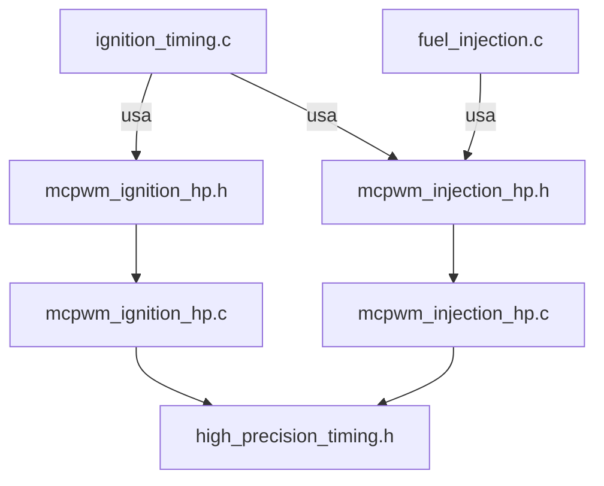

# Plano de Correção de Compilação - ESP32-EFI

## Visão Geral

O projeto ESP32-EFI apresenta erros de compilação devido a inconsistências entre headers e implementações. Este documento detalha os passos necessários para corrigir todos os problemas.

## Análise dos Problemas

### 1. Funções MCPWM Ausentes

Os arquivos `ignition_timing.c` e `fuel_injection.c` chamam funções que não estão declaradas:

| Arquivo | Função Chamada | Status |
|---------|---------------|--------|
| `ignition_timing.c:54` | `mcpwm_ignition_init()` | Não declarada |
| `ignition_timing.c:55` | `mcpwm_injection_init()` | Não declarada |
| `ignition_timing.c:104` | `mcpwm_ignition_schedule_one_shot()` | Não declarada |
| `ignition_timing.c:111` | `mcpwm_ignition_start_cylinder()` | Não declarada |
| `fuel_injection.c:74` | `mcpwm_injection_schedule_one_shot()` | Não declarada |

### 2. Estrutura de Drivers MCPWM

**Análise importante**: Não existem drivers legados implementados!

```
Arquivos no src/:
✗ mcpwm_injection.c     - NÃO EXISTE
✗ mcpwm_ignition.c      - NÃO EXISTE
✓ mcpwm_injection_hp.c  - IMPLEMENTADO (10.7KB)
✓ mcpwm_ignition_hp.c   - IMPLEMENTADO (9.6KB)
```

### 3. Funções HP Disponíveis

**mcpwm_injection_hp.h:**
- `mcpwm_injection_hp_init()` - inicializa driver
- `mcpwm_injection_hp_schedule_one_shot_absolute(cylinder_id, delay_us, pulsewidth_us, current_counter)` - agenda injeção
- `mcpwm_injection_hp_get_counter(cylinder_id)` - obtém contador atual
- `mcpwm_injection_hp_deinit()` - desinicializa

**mcpwm_ignition_hp.h:**
- `mcpwm_ignition_hp_init()` - inicializa driver
- `mcpwm_ignition_hp_schedule_one_shot_absolute(cylinder_id, target_us, rpm, battery_voltage, current_counter)` - agenda ignição
- `mcpwm_ignition_hp_get_counter(cylinder_id)` - obtém contador atual
- `mcpwm_ignition_hp_deinit()` - desinicializa

## Solução Escolhida: Usar HP Diretamente

### Por que usar HP diretamente?

| Critério | Usar HP Diretamente | Adicionar Wrappers |
|----------|---------------------|-------------------|
| Arquivos modificados | 2 arquivos .c | 2 arquivos .c + 2 headers |
| Overhead de chamada | Zero | Mínimo (1 função extra) |
| Clareza do código | Melhor (nomes consistentes) | Pior (nomes diferentes) |
| Manutenção | Mais simples | Mais complexa |

## Plano de Ação

### Passo 1: Atualizar ignition_timing.c

**Mudanças necessárias:**

1. **Includes** (linhas 3-4):
```c
// De:
#include "../include/mcpwm_ignition.h"
#include "../include/mcpwm_injection.h"

// Para:
#include "../include/mcpwm_ignition_hp.h"
#include "../include/mcpwm_injection_hp.h"
```

2. **Função ignition_init()** (linhas 53-63):
```c
// De:
bool ign_ok = mcpwm_ignition_init();
bool inj_ok = mcpwm_injection_init();

// Para:
bool ign_ok = mcpwm_ignition_hp_init();
bool inj_ok = mcpwm_injection_hp_init();
```

3. **Função ignition_apply_timing()** (linha 104):
```c
// De:
mcpwm_ignition_schedule_one_shot(cylinder, delay_us, rpm, battery_voltage);

// Para:
uint32_t counter = mcpwm_ignition_hp_get_counter(cylinder - 1);
mcpwm_ignition_hp_schedule_one_shot_absolute(cylinder, delay_us, rpm, battery_voltage, counter);
```

4. **Função ignition_apply_timing()** (linha 111):
```c
// De:
mcpwm_ignition_start_cylinder(cylinder, rpm, advance_degrees, battery_voltage);

// Para:
uint32_t counter = mcpwm_ignition_hp_get_counter(cylinder - 1);
mcpwm_ignition_hp_schedule_one_shot_absolute(cylinder, 1000, rpm, battery_voltage, counter);
```

### Passo 2: Atualizar fuel_injection.c

**Mudanças necessárias:**

1. **Include** (linha 2):
```c
// De:
#include "../include/mcpwm_injection.h"

// Para:
#include "../include/mcpwm_injection_hp.h"
```

2. **Função fuel_injection_schedule_eoi_ex()** (linha 74):
```c
// De:
return mcpwm_injection_schedule_one_shot((uint8_t)(cylinder_id - 1), delay_us, pulsewidth_us);

// Para:
uint32_t counter = mcpwm_injection_hp_get_counter((uint8_t)(cylinder_id - 1));
return mcpwm_injection_hp_schedule_one_shot_absolute((uint8_t)(cylinder_id - 1), delay_us, pulsewidth_us, counter);
```

## Diagrama de Dependências



## Arquivos a Modificar

| Arquivo | Modificação | Linhas Afetadas |
|---------|-------------|-----------------|
| `src/control/ignition_timing.c` | Mudar includes e chamadas | 3-4, 54-55, 104, 111 |
| `src/control/fuel_injection.c` | Mudar includes e chamadas | 2, 74 |

## Ordem de Execução

1. **Atualizar ignition_timing.c** - Mudar includes e chamadas de função
2. **Atualizar fuel_injection.c** - Mudar includes e chamadas de função
3. **Compilar e verificar** - Verificar se todos os erros foram resolvidos

## Estimativa

- **Complexidade**: Baixa
- **Risco**: Mínimo (apenas mudanças de API)
- **Impacto**: Localizado nos módulos de controle
- **Linhas de código**: ~10 linhas modificadas

## Status

- [x] Análise dos problemas
- [x] Identificação das funções HP disponíveis
- [x] Definição da solução
- [ ] Implementação das mudanças
- [ ] Compilação e verificação
